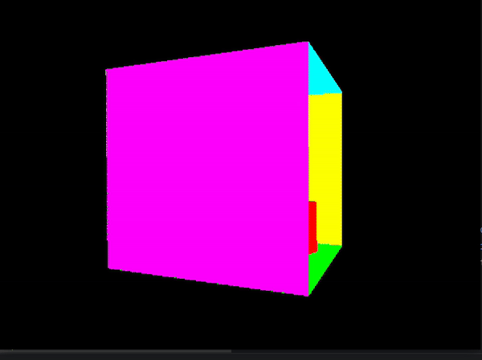

# Realistic 3D Graphics Engine

**Project Duration:** Sep. 2023 -- Dec. 2023  
**Technologies Used:** C++ with SDL2
  - 
  - 
  - 

This project is a 3D Rendering and Animation Engine designed to render realistic 3D graphics.

## Features

### Core Functionality
- **OBJ Geometry and Material File Loading:**
  - Implemented an OBJ file reader to load and render 3D models.
  - Supported loading of associated materials for enhanced realism.

- **Rendering Techniques:**
  - **Wireframe 3D Scene Rendering:** Rendered 3D scenes in a wireframe mode, providing a structural view of models.
  - **Flat Colour 3D Scene Rasterising:** Rendered 3D scenes with flat colors for simple but effective visual representation.
  - Integrated keyboard control for camera orientation using an orientation matrix, allowing dynamic viewing angles.
  - 
  - 
  - **Surface Texture Mapping:** Applied detailed textures to surfaces for more realistic rendering.
  - 

### Advanced Lighting and Shading
- **Lighting Techniques:**
  - **Ambient Lighting:** Implemented ambient lighting to ensure a minimum light threshold or universal light supplement across the scene.
  - **Diffuse Lighting:** Calculated and rendered lighting based on proximity and angle of incidence, contributing to the realism of objects.
  - **Specular Lighting:** Added visible specular highlights (specular spots) to represent shiny surfaces and light reflections.
  - 

### Shadow Rendering and Reflection
- **Shadow Rendering:**
  - **Hard Shadow Rendering:** Produced shadows with hard edges for stark contrast.
  - **Soft Shadow Rendering:** Implemented smooth and elegant soft shadows for a more natural look.
  - 
  

- **Reflective Materials:**
  - Integrated reflective materials such as mirrors and metals that interact with lighting to reflect their surroundings.
  - 

 
- **Shading Techniques:**
  - **Gouraud Shading:** Applied smooth shading by interpolating vertex colors across surfaces.
  - **Phong Shading:** Enhanced smoothness and lighting effects with Phong shading for more sophisticated visual outcomes.
  - 
